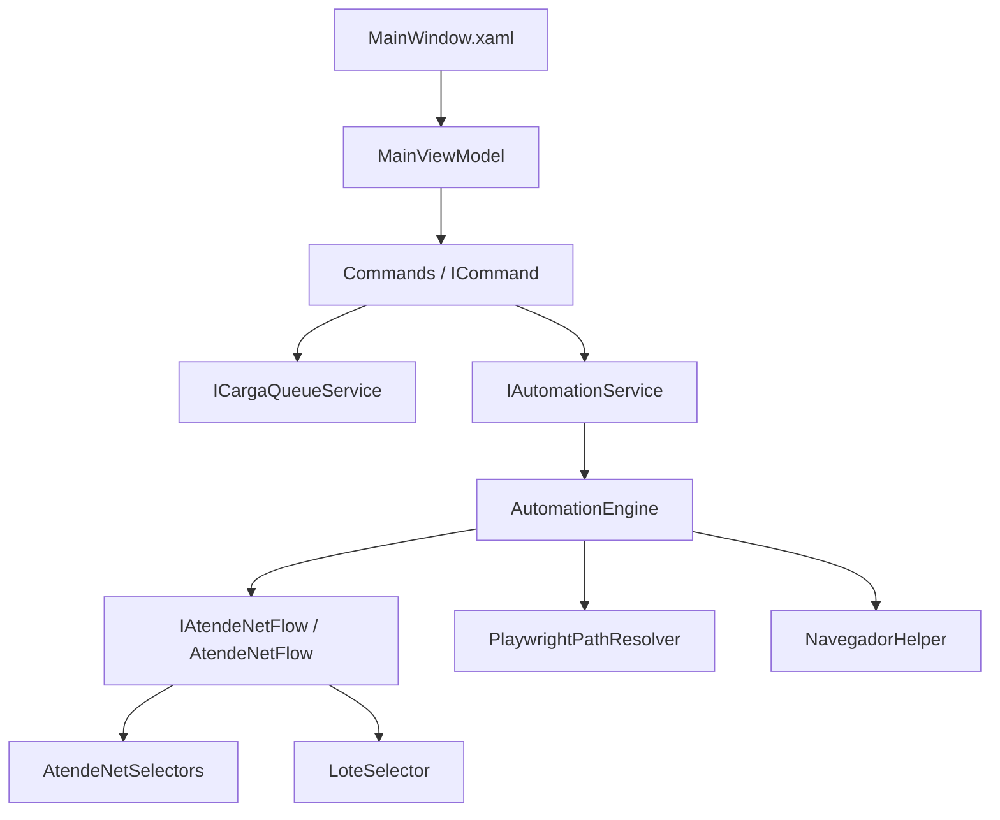

# TransferTool RPA

O **TransferTool RPA** é uma aplicação desktop desenvolvida em C# / .NET 8 com WPF (Windows Presentation Foundation) para a Automação Robótica de Processos (RPA) de transferências de mercadorias. O robô interage diretamente com o DOM do portal web **Atende.Net** (ERP da IPM Sistemas) utilizando o Microsoft Playwright por meio de conexões CDP (Chrome DevTools Protocol).

Esta ferramenta atua de forma integrada com o **TransferTool Mobile**, importando payloads JSON de cargas geradas offline e automatizando a digitação manual de operador humano no ERP da prefeitura, mitigando erros logísticos e agilizando a distribuição.

> 📊 **Status:** primeira transferência **E2E concluída** (2026-09-24). O estado detalhado da sessão, os gargalos abertos e as lições aprendidas ficam em [`PROJECT_REPORT.md`](PROJECT_REPORT.md) e [`Atlas.md`](Atlas.md).

---

## 🏗️ Arquitetura de Software e Padrões

O projeto foi reestruturado sob os princípios da **Clean Architecture** e adota o padrão **Clean MVVM (Model-View-ViewModel)** aliado ao **Command Pattern puro**, garantindo testabilidade isolada e desacoplamento de responsabilidades:



### Principais Componentes

**Views**
* [`MainWindow.xaml`](MainWindow.xaml): UI Dark Fluent (Windows 11) com importação por drag-and-drop de JSON, fila de cargas, log em tempo real e `GridSplitter` para redimensionar os painéis.

**ViewModels**
* [`ViewModels/MainViewModel.cs`](ViewModels/MainViewModel.cs): estado reativo da UI (`INotifyPropertyChanged`) e exposição dos comandos de forma desacoplada.

**Commands** (pasta `Commands/`, cada um com responsabilidade única, implementando `ICommand`)
* `AbrirNavegadorCommand`, `ImportarCargaCommand`, `IniciarAutomacaoCommand`, `CancelarAutomacaoCommand`, `ExcluirCargaCommand`.

**Services**
* `ICargaQueueService` / `CargaQueueService`: fila de payloads thread-safe na thread da UI.
* `IAutomationService` / `PlaywrightAutomationService`: dispara o motor Playwright.
* `ILoggerService` / `ObservableLoggerService`: logs concorrentes para o console visual do WPF.
* `IPayloadService` / `PayloadService`: leitura e parse dos JSONs de carga.

**Models (dados, seletores e algoritmo)**
* [`Models/TransferenciaPayload.cs`](Models/TransferenciaPayload.cs): contratos JSON fortemente tipados + `PayloadValidator` (sanitização de inputs).
* [`Models/AutomationEngine.cs`](Models/AutomationEngine.cs): engine Playwright que orquestra o navegador (CDP).
* [`Models/AtendeNetFlow.cs`](Models/AtendeNetFlow.cs) + [`Models/IAtendeNetFlow.cs`](Models/IAtendeNetFlow.cs): fluxo de alto nível (navegação, origem/destino, filtro, lote, carrinho e confirmação); a interface permite testes com mocks.
* [`Models/AtendeNetSelectors.cs`](Models/AtendeNetSelectors.cs): **único ponto de manutenção dos seletores** do ERP.
* [`Models/LoteSelector.cs`](Models/LoteSelector.cs): algoritmo puro de desempate logístico de lotes (1º validade mais curta, 2º menor quantidade).
* [`Models/NavegadorHelper.cs`](Models/NavegadorHelper.cs): abertura/conexão do Chrome/Edge via CDP.
* [`Models/PlaywrightPathResolver.cs`](Models/PlaywrightPathResolver.cs): resolve os caminhos do driver e dos browsers do Playwright em runtime.

---

## 🤖 Fluxo de Automação do Robô (Passo a Passo)

O robô assume a execução a partir do **Passo 4** da rotina operacional de almoxarifado:
1. **Passo 3 (Consulta Aberta):** o operador faz login humano e abre a tela de consulta de transferências (`Almoxarifado » Movimento » Transferência`).
2. **Passo 4 (Acesso à Inclusão):** o robô abre "Outras opções" (`aside.area_acoes span.drop_down`) e aciona "Incluir transferência" (`#context_menu tr:nth-of-type(1) span > span`).
3. **Passo 5 (Depósitos):** preenche Origem e Destino (`aside input.campo-numerico`), dispara `Tab` e aguarda a validação AJAX do ERP.
4. **Passo 6 (Produto):** digita o código no campo de filtro da janela ativa (`[id^="janela_"].janela_ipm_ativa aside td:nth-of-type(3) > input`) e pressiona `Enter`.
5. **Passo 7 (Configuração de Colunas):** garante a coluna "Validade" visível (engrenagem `div.area_total_janela > div span:nth-of-type(5) > input` → marca `ins.jstree-checkbox` → aplicar/fechar).
6. **Passo 8 (Seleção de Lote & Inclusão):** identifica as células da grade pelo atributo estável **`nomecoluna`** (`prdcodigo`, `estdatavalidade`, `estquantidade`) e usa o `LoteSelector` para escolher o melhor lote (1º validade mais curta; 2º menor quantidade; completamento automático se a quantidade pedida exceder o lote). Preenche `input[name="quantidade_transferir"]` e clica em `button[name="botao_incluir"]`.
7. **Passo 9 (Iteração):** repete os passos 6–8 para todos os itens da carga.
8. **Passo 10 (Confirmação):** clica em "Confirmar" (`button.estrutura_botao_colorido`) e aceita o modal opcional de simulação.

> **Seletores-chave (aprendizados do mapeamento real):**
> - A grade e o carrinho usam **`data-subcontexto-id="..."`** (NÃO `id="..."`):
>   - Lotes: `[data-subcontexto-id="subcontexto_dados_tela_consulta_estoque"] tbody tr`
>   - Carrinho: `[data-subcontexto-id="subcontexto_dados_grid_itens_transferencia"] tbody tr.linha_dados`
> - Janela ativa: `[id^="janela_"].janela_ipm_ativa` (desambigua consulta × inclusão).
> - Quantidade lida em cultura **pt-BR** (`NumberStyles.Number` + `CultureInfo("pt-BR")`).

---

## 🚀 Como Executar

### Pré-requisitos
* **.NET SDK 8.0** (Windows).
* **Google Chrome** ou **Microsoft Edge** no caminho padrão.

### 1. Build e testes
```bash
dotnet build -c Release
dotnet test
```

### 2. Publish (self-contained, SEM single-file)
```bash
dotnet publish TransferToolRPA.csproj -c Release -r win-x64 --self-contained true -o ./publish
```
> O publish é **self-contained sem single-file** (o single-file faz `Assembly.Location` retornar vazio e quebra a resolução do driver do Playwright). O target MSBuild `CopyPlaywrightBrowsers` copia a pasta `.playwright/` (driver `node.exe` + browsers `chromium-*`/`ffmpeg-*`) para o publish.
> **Distribuição:** envie a pasta inteira como ZIP e rode `TransferToolRPA.exe` **de dentro** da pasta (não copie apenas o `.exe`).

### 3. Conexão CDP (porta 9222)
1. Abra o Chrome com depuração remota **ou** use o botão **🌐 Abrir Chrome** do próprio app:
   ```powershell
   & "C:\Program Files\Google\Chrome\Application\chrome.exe" --remote-debugging-port=9222 --user-data-dir="$env:LOCALAPPDATA\TransferToolRPA\ChromeProfile" "https://alvorada.atende.net/atende.php?rot=1&aca=1#!/sistema/28"
   ```
2. Faça o **login humano** e navegue até a tela de consulta de transferências.
3. Abra o `TransferToolRPA.exe`, arraste o JSON exportado pelo **TransferTool Mobile** para a área de drag-and-drop e clique em **Iniciar RPA** — as cargas da fila são processadas sequencialmente.

> ⚠️ **Segurança:** com a porta 9222 aberta, qualquer processo local pode controlar o browser. Não navegue em sites sensíveis com esse Chrome aberto.
> **Diagnóstico de erro:** screenshot + HTML + frames são gravados em `%LOCALAPPDATA%\TransferToolRPA\Diagnostico`.

---

## 🧪 Suíte de Testes Automatizados (xUnit)

A aplicação conta com **78 casos de teste** (59 `[Fact]` + 19 casos `[Theory]/InlineData`), distribuídos em 8 arquivos:

| Arquivo | Casos | Foco |
|---------|------:|------|
| `PayloadServiceTests.cs` | 25 | Parsing e validação do payload |
| `PayloadSecurityTests.cs` | 8 | Injeção, Path Traversal e limites |
| `AtendeNetFlowErrorScenariosTests.cs` | 11 | Grade vazia, timeouts e fluxos de erro |
| `AutomationEngineTests.cs` | 7 | Orquestração, progresso e cancelamento |
| `AutomationIntegrationTests.cs` | 9 | Hostname do WebSocket CDP e seletores |
| `LoteSelectorTests.cs` | 7 | Ordenação de lotes sob timezones variados |
| `AtendeNetFlowLogicTests.cs` | 6 | Regras de seleção de lote |
| `PlaywrightPathResolverTests.cs` | 5 | Resolução de driver/browsers (env vars, idempotência) |
| **Total** | **78** | |

Para executar a partir da pasta raiz:
```bash
dotnet test
```

---

## 📚 Documentação e Referências

* [`PROJECT_REPORT.md`](PROJECT_REPORT.md): relatório de estado do projeto, histórico de blockers resolvidos, gargalos abertos, próximos passos e catálogo de skills.
* [`Atlas.md`](Atlas.md): ledger de lições aprendidas (drift) mantido pelo skill `atlas-ledger`.
* `Artefatos/` (**local, não versionado**): gravações de fluxo executadas no ERP e payloads de exemplo exportados pelo app mobile.
