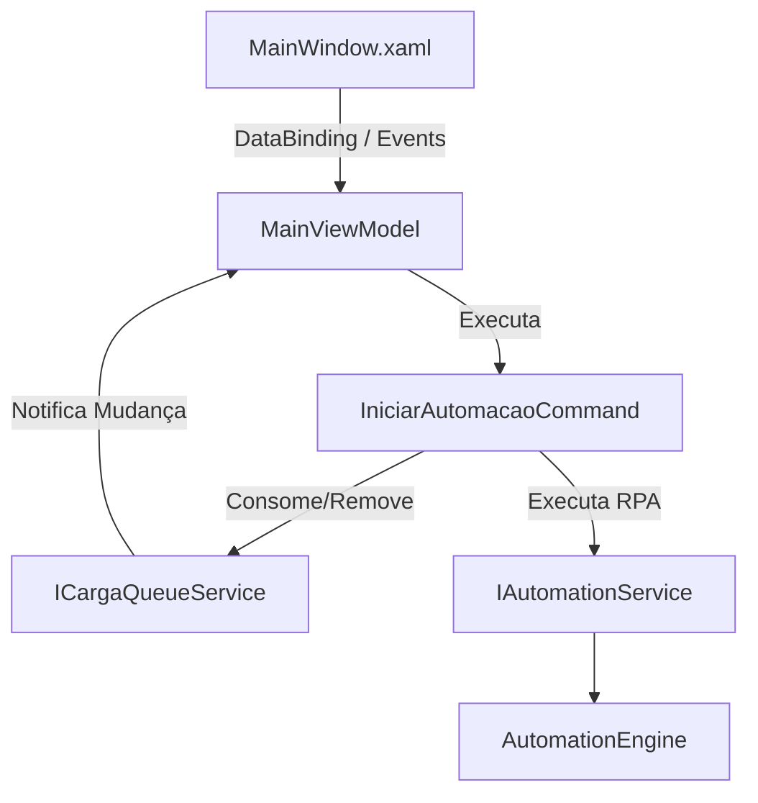

# TransferTool RPA

O **TransferTool RPA** é uma aplicação desktop desenvolvida em C# / .NET 8 com WPF (Windows Presentation Foundation) para a Automação Robótica de Processos (RPA) de transferências de mercadorias. O robô interage diretamente com o DOM do portal web **Atende.Net** (ERP da IPM Sistemas) utilizando o Microsoft Playwright por meio de conexões CDP (Chrome DevTools Protocol).

Esta ferramenta atua de forma integrada com o **TransferTool Mobile**, importando payloads JSON de cargas geradas offline e automatizando a digitação manual de operador humano no ERP da prefeitura, mitigando erros logísticos e agilizando a distribuição.

---

## 🏗️ Arquitetura de Software e Padrões

O projeto foi reestruturado sob os princípios da **Clean Architecture** e adota o padrão **Clean MVVM (Model-View-ViewModel)** aliado ao **Command Pattern puro**, garantindo testabilidade isolada e desacoplamento de responsabilidades:



### Principais Componentes:
* **Views (Interface Gráfica):** [MainWindow.xaml](MainWindow.xaml) renderiza a UI no estilo Dark Fluent (Windows 11), permitindo importação por drag-and-drop de arquivos JSON, controle de fila e visualização de log em tempo real com redimensionamento de painéis via `GridSplitter`.
* **ViewModels:** [MainViewModel.cs](ViewModels/MainViewModel.cs) gerencia exclusivamente as propriedades reativas do estado da UI (`INotifyPropertyChanged`) e expõe comandos de forma desacoplada.
* **Services (Camada de Serviços):**
  * `ICargaQueueService` / `CargaQueueService`: Gerencia a fila de payloads de forma thread-safe na linha de execução da UI.
  * `IAutomationService` / `PlaywrightAutomationService`: Abstrai o disparo do motor do Playwright.
  * `ILoggerService` / `ObservableLoggerService`: Centraliza e propaga logs concorrentes para o console visual do WPF.
* **Commands (Single Responsibility):** Ações especializadas na pasta `Commands/` que herdam de `ICommand` e operam sobre serviços abstratos.
* **Models (Algoritmo e Dados):**
  * [TransferenciaPayload.cs](Models/TransferenciaPayload.cs): Contratos JSON fortemente tipados e o `PayloadValidator` (sanitização de inputs).
  * [LoteSelector.cs](Models/LoteSelector.cs): Algoritmo puro de desempate logístico de lotes (1º validade mais curta, 2º menor quantidade em estoque).
  * [AutomationEngine.cs](Models/AutomationEngine.cs): Engine Playwright responsável pela orquestração do navegador.

---

## 🤖 Fluxo de Automação do Robô (Passo a Passo)

O robô assume a execução a partir do **Passo 4** da rotina operacional de almoxarifado:
1. **Passo 3 (Consulta Aberta):** O operador faz login humano e abre a tela de consulta de transferências (`Almoxarifado » Movimento » Transferência`).
2. **Passo 4 (Acesso à Inclusão):** O robô clica no dropdown "Transferências" pelo atributo estável `span[name='543']` e aciona "Incluir transferência" por `span[name='102']`.
3. **Passo 5 (Depósitos):** Preenche o código de depósito de Origem e Destino (`saida_depcodigo` e `entrada_depcodigo`), disparando o `Tab` e aguardando a validação das requisições AJAX do ERP.
4. **Passo 6 (Produto):** Digita o código do produto no campo `prdcodigo` e pressiona `Enter`.
5. **Passo 7 (Configuração de Colunas):** Verifica se a coluna "Validade" está visível no grid. Se necessário, clica na engrenagem (`name='preferencia_campos'`), marca "Validade", aplica e fecha.
6. **Passo 8 (Seleção de Lote & Inclusão):** Executa a **indexação dinâmica de cabeçalhos** (`th`) para encontrar os índices reais das colunas de data e estoque (evitando quebras por mudanças de layout do ERP). O algoritmo `LoteSelector` escolhe o melhor lote, preenche a quantidade e clica em "Incluir".
7. **Passo 9 (Iteração):** Repete os passos 6 a 8 para todos os itens da lista de carga.
8. **Passo 10 (Confirmação):** Clica em "Confirmar" e aceita o popup opcional de simulação de transação (`Janela.confirm`).

---

## 🚀 Como Executar

### Pré-requisitos
* **SDK do .NET 8.0** ou superior instalado no Windows.
* **Google Chrome** ou **Microsoft Edge** instalado no caminho padrão.

### Execução e Conexão CDP
1. Inicialize a aplicação compilada pelo executável ou via terminal:
   ```bash
   dotnet run --project TransferToolRPA.csproj
   ```
2. Clique no botão **🌐 Abrir Chrome** no canto superior direito do cabeçalho da janela do WPF. O aplicativo abrirá o Chrome isolado com perfil limpo na porta de depuração remota `9222` apontando diretamente para o portal Atende.Net.
3. Faça o login humano normalmente e navegue até a tela de consulta de transferências.
4. Arraste o arquivo JSON exportado do aplicativo Mobile para a área de drag-and-drop à esquerda.
5. Inicie o RPA pelo botão **Iniciar RPA**. As cargas da fila serão processadas de forma sequencial.

---

## 🧪 Suíte de Testes Automatizados (xUnit)

A aplicação conta com **33 testes automatizados** cobrindo frentes críticas de segurança, regressão e integrações.

Para executar os testes a partir da pasta raiz:
```bash
dotnet test
```

### Estrutura dos Testes:
1. **Testes de Integração ([AutomationIntegrationTests.cs](TransferToolRPA.Tests/AutomationIntegrationTests.cs)):** Verifica a higienização de hostnames do WebSocket debugger do Chrome e valida a conexão no barramento HTTP CDP da porta 9222.
2. **Testes de Regressão ([LoteSelectorTests.cs](TransferToolRPA.Tests/LoteSelectorTests.cs)):** Garante a ordenação correta dos lotes de estoque sob timezones de data variados (ISO-8601, UTC, strings brasileiras) e previne desvios em empates de validade e quantidade.
3. **Testes de Segurança ([PayloadSecurityTests.cs](TransferToolRPA.Tests/PayloadSecurityTests.cs)):** Garante que o parser rejeite payloads maliciosos contendo injeções de comandos, Path Traversal (`../`), excesso de caracteres (buffer overflow) ou negação de serviço por estouro de valores numéricos.
